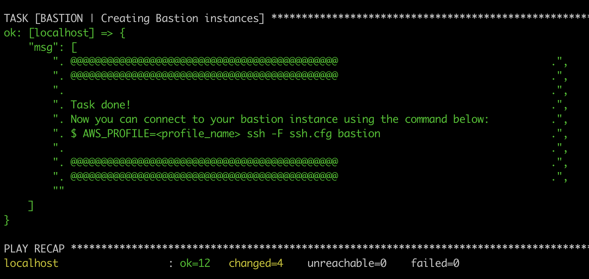
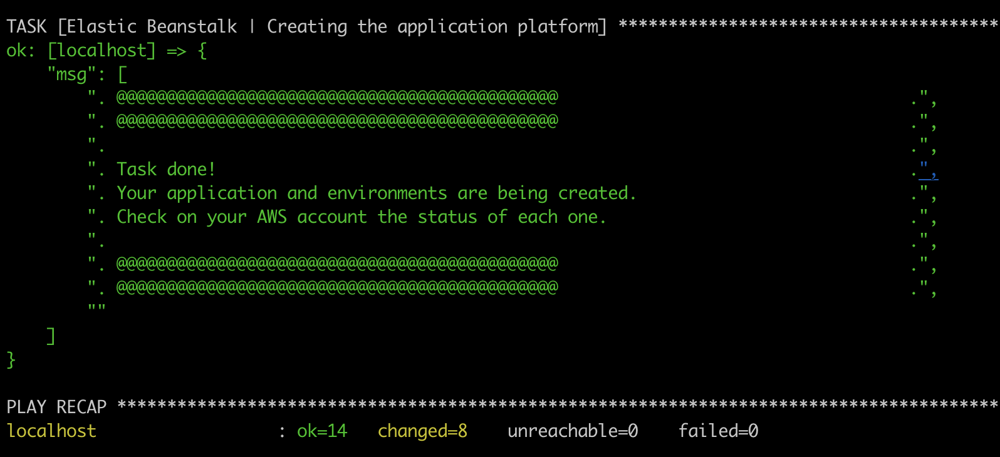
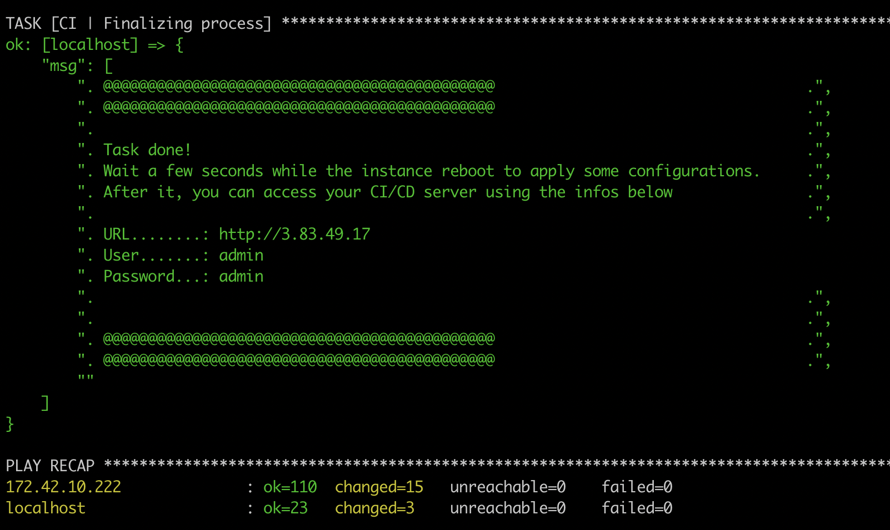
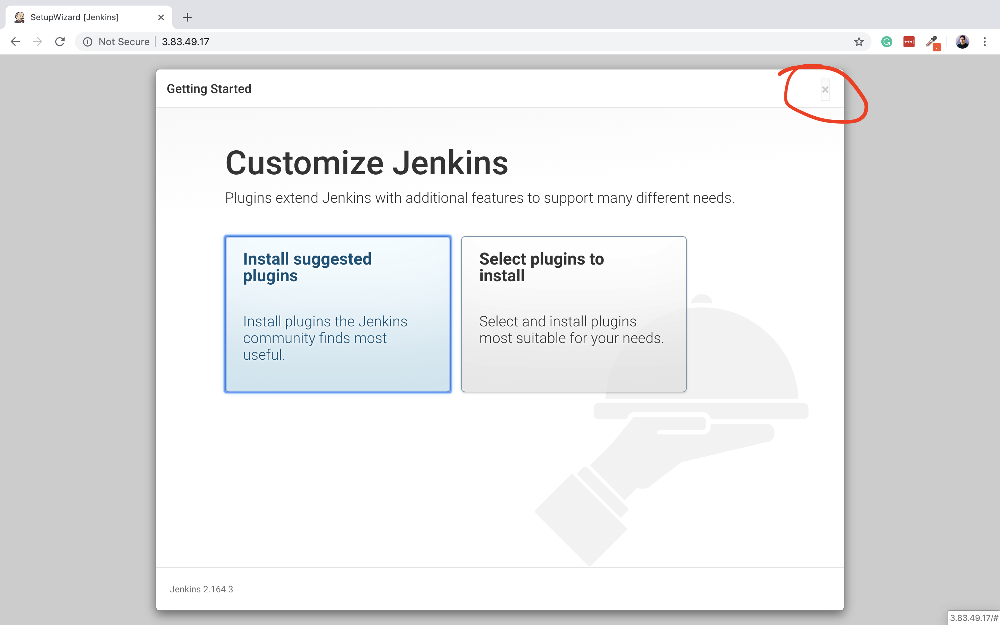
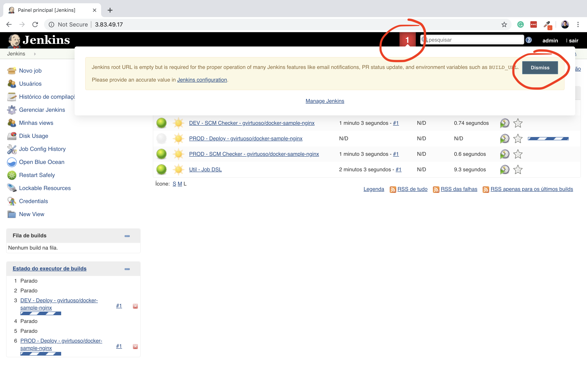
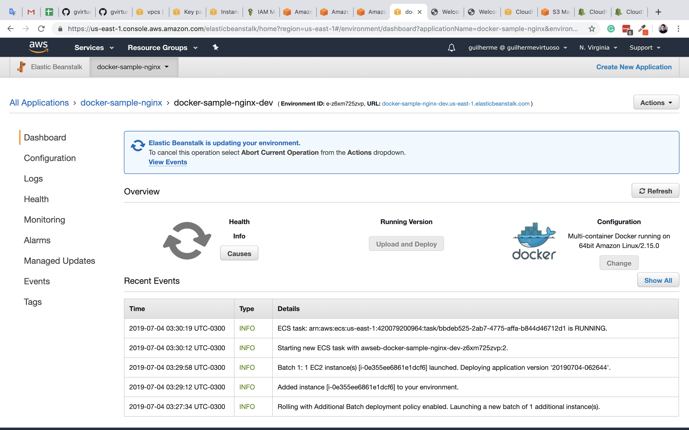
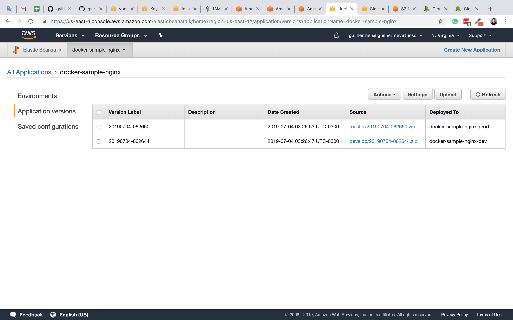
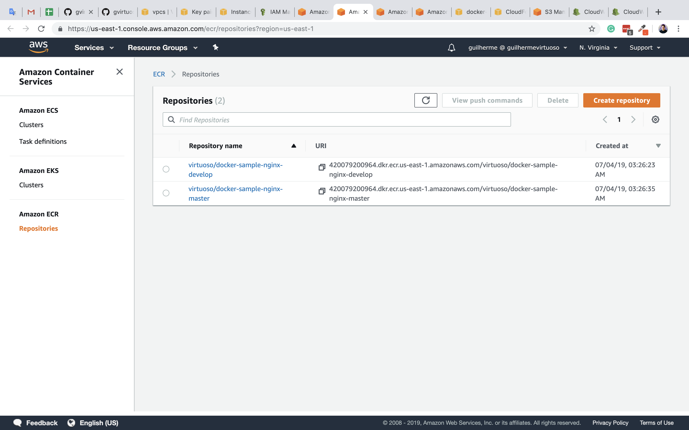
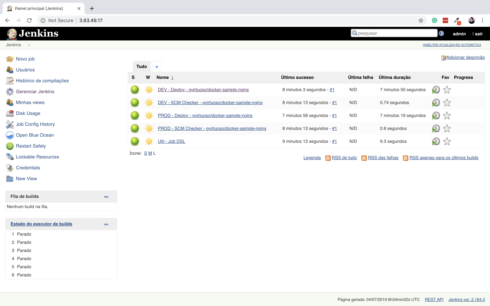
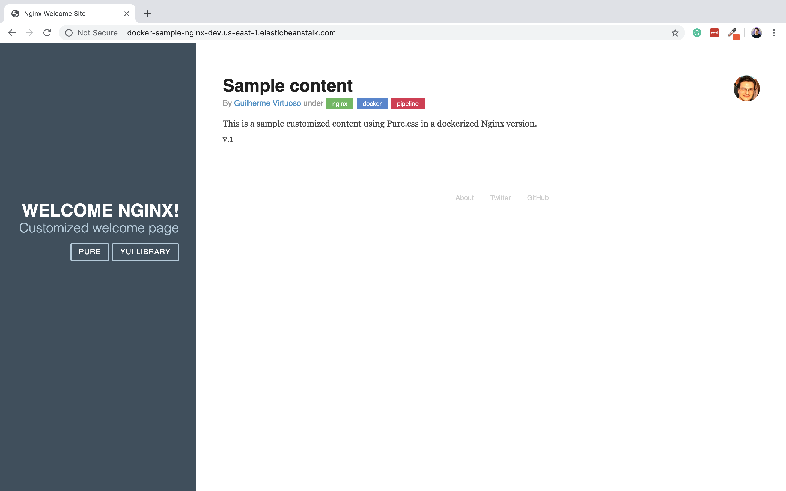

# ansible-aws-elasticbeanstalk-jenkins-pipeline
This stack will provide a full CI/CD infrastructure on AWS using Ansible

It will create the following resources:
- VPC
- EC2 Keypair
- Bastion instance for SSH tunneling
- Elastic Beanstalk with Blue/Green deployment
- CI/CD Pipeline using Jenkins

---

## 1) Requirements/Versions
These are the versions of each requisite used during the development of this project.  
In some cases, I've noticed that using different versions of these tools some errors could happen.  
I'll encourage you to run the playbooks even if you have a different version of any of them, but keep in mind that if you are facing some issue the reason could be these versions.

- `Python` (Python 2.7.10)
- `Python Libs` (Boto, Boto3 and BotoCore for Python 2.x and 3.x)
- `Ansible 2.7` (ansible 2.7.x + Python 3.7.x embedded)
- `AWS Command Line` (aws-cli/1.16.110 Python/3.7.2 Darwin/18.6.0 botocore/1.12.100)
- `JQ` - Command-line JSON processor

---

## 2) AWS Commando Line (aws-cli)
Following the best practices and to be compatible with this project, you should configure your AWS Command Line to use profiles.

`IMPORTANT:` Be aware that I'll use your profile name to create unique identifiers on your AWS account.

```shell
$ aws configure --profile <PROFILE_NAME>

AWS Access Key ID [None]: <ACCESS_KEY_ID>
AWS Secret Access Key [None]: <SECRET_KEY>
Default region name [None]: <DEFAULT_REGION>
Default output format [None]: <OUTPUT>
```

This command will change the files at `<HOME_USER_FOLDER>/.aws`

For more information about how to configure or even how to install the AWS Command Line you can access the  [AWS documentation](https://docs.aws.amazon.com/cli/index.html).

---

## 3) Running playbooks
To run the playbooks in a proper way you have to pass your `AWS_PROFILE`, configured like in the previous step, on the command line.  
This is the safest way to deal with your AWS credentials without exposing any sensitive data.

```shell
$ AWS_PROFILE=<PROFILE_NAME> ansible-playbook <playbook file>
```

---

## 4) Creating the infrastructure

Run the steps below to create the entire CI/CD infrastructure.  
You will run all files with the prefix `infra`.  
The file's name follows a logical order where each one should be executed.

---

### 4.1) File [001.infra-vpc.yml](001.infra-vpc.yml)

```shell
$ AWS_PROFILE=<PROFILE_NAME> ansible-playbook 001.infra-vpc.yml
```

This playbook will create a new VPC in your account. I'm using a flat architecture for this use case to keep it simple, but I strongly recommend that you implement some level of isolation using Public and Private subnets.

To change the CIDR and the subnet mapping for this VPC please check the [vpc.yml](aws/vars/infra/vpc.yml) var file.  
For this case, I'm mapping all the six zones of `N.Virginia(us-east-1)` region.

After you run this playbook, you should get an output similar to the one below:


---

### 4.2) File [002.infra-key.yml](002.infra-key.yml)

```shell
$ AWS_PROFILE=<PROFILE_NAME> ansible-playbook 002.infra-key.yml
```

This playbook will create a new EC2 KeyPair for use on all instances created by this project.  
You also will be able to connect using SSH on these instances running simple commands from this project. (I'll show you how to do it on the next steps)

This routine will expect two files in the `files/sshkeys` folder.  
A public and a private ssh key file.  
These files should have the same name of the var `application` configured on the playbook. (`virtuoso` for this case)  
You can use the existent ones or you can generate your own files using the [ssh-keygen](https://www.ssh.com/ssh/keygen/) on Unix systems.

After you run this playbook, you should get an output similar to the one below:


---

### 4.3) File [003.infra-bastion.yml](003.infra-bastion.yml)

```shell
$ AWS_PROFILE=<PROFILE_NAME> ansible-playbook 003.infra-bastion.yml
```

It's a best practice never expose your port 22 (SSH) to the internet. Thinking on it is strongly recommended use a [Bastion Instance](https://docs.aws.amazon.com/quickstart/latest/linux-bastion/architecture.html) to make an SSH tunneling to access your instances.

Running this playbook you will do that, creating a bastion instance based on the parameters in [bastion.yml](aws/vars/infra/bastion.yml) var file.

For fail tolerance is highly recommended that you have an AutoScaling group + Network Load Balancer ensuring that you always have a bastion running.  
For this example, to keep it simple, I'm are using a flat infrastructure with only one instance in one zone without AutoScaling.

After you run this playbook, you should get an output similar to the one below:



It's time to test your SSH connection for the first time.
We have a [ssh.cfg](ssh.cfg) on the root folder that will apply come customizations to your SSH protocol

```shell
$ AWS_PROFILE=<PROFILE_NAME> ssh -F ssh.cfg bastion
```
Since is your first time connecting to this machine, your OS will ask you to allow this unknown host to connect.


Type `YES` to continue and establish the connection.

`IMPORTANT:` You need to do that connection to ensure the success in the next phases because we need that the bastion is already known by the system and connect without problems

---

### 4.4) File [004.infra-elasticbeanstalk.yml](004.infra-elasticbeanstalk.yml)

```shell
$ AWS_PROFILE=<PROFILE_NAME> ansible-playbook 004.infra-elasticbeanstalk.yml
```

This playbook will create an Elastic Beanstalk distribution. All the configuration for it is in the [elasticbeanstalk.yml](aws/vars/infra/elasticbeanstalk.yml) var file. I'm also using a template to generate all application configuration like Network, LoadBalancer, Deploy Strategy, Logs, Capacity, Security, etc. ([elasticbeanstalk-template.j2](templates/elasticbeanstalk-template.j2)). You can get more info [here](https://docs.aws.amazon.com/AWSCloudFormation/latest/UserGuide/aws-resource-elasticbeanstalk-configurationtemplate.html) to customize your own environment.

After you run this playbook, you should get an output similar to the one below:



`IMPORTANT:` For this example, I'm creating a simple Application called [docker-sample-nginx](https://github.com/gvirtuoso/docker-sample-nginx) with two environments (`dev` and `prod`).

A lot of resources will be generated when you create an Elastic Beanstalk application:

- Elastic Beanstalk Multi Container application with environments
- AutoScaling group to scale the number of instances in case of a high network usage
- Cloudwatch Alarms to support the AutoScaling group
- Cloudwatch Logs to save the log files from the environments
- S3 bucket to support the versions management
- ECS cluster running in the Elastic Beanstalk background
- ECS Task Definitions for each environment
- IAM roles to allow instances to access to the resources involved in the solution
- CloudFormation stack to manage all resources


You can click on each environment and access the public DNS to check if everything is working properly.


For fresh environments, the platform installs a Sample Application as you can see below.  
After creating the CI/CD server (the next step) my version of the [docker-sample-nginx](https://github.com/gvirtuoso/docker-sample-nginx) will be deployed and replace this Sample Application.


---

### 4.5) File [005.infra-jenkins.yml](005.infra-jenkins.yml)

```shell
$ AWS_PROFILE=<PROFILE_NAME> ansible-playbook 005.infra-jenkins.yml
```

Now is time to run the CI/CD playbook that will create an instance and install a lot of tools to be ready to build docker projects. To support more stacks we have to improve our configuration. 
To keep it simple, I'm using the `master` as a worker instance, but in a production environment, you should use `slaves` to run your jobs.

This playbook will take more time than the others because it will create the instance and after that, it will connect on that new instance and it will make all the configurations to have your Jenkins up and running already with job definition.

During the configuration phase, using Groovy Scripts, I'll create a seeder job that will be in charge to read the project (the `dsl` folder) and execute all the `groovy` files to create automatically the jobs responsible for check coding changes on Github and starts to build the docker images, to send to ECR and starts the deployment process on the Elastic Beanstalk platform.

In the [ci.yml](aws/vars/infra/ci.yml) var file you can configure a lot of details of your CI/CD server including:
- `jenkins_admin_username` - Admin username
- `jenkins_admin_password` - Admin password
- `jenkins_version` - Usually I lock this value for the LTS version
- `jenkins_plugins_list` - All plugin IDs that you want to install on Jenkins

`IMPORTANT:` If you get some error like (SSH timeout connection) while running the playbook, you can try again.  
These playbooks are developed to be [idempotent](https://en.wikipedia.org/wiki/Idempotence).

After you run this playbook, you should get an output similar to the one below:



Now you will be able to access your CI/CD instance. 

In your first access, some screens will show up for you. You can ignore the first one clicking on the "X" on the top right corner.



And in the next screen you can click on `"Start using Jenkins"` button.


You will be redirect to the main screen where you will see a red alert on the top. This alert is because we are not using a Domain Name as our Jenkins URL. You can click on the alert and `"Dismiss"` this information



Good job!  
Now you already have your CI/CD server up and running.

---

## 5) Deployment

Usually, I have the deployment files in another project, but for this example, trying to make it simple and didactic I keep the deployment files in the same project. 

For this use case, where we have created an application on Elastic Beanstalk for [docker-sample-nginx](https://github.com/gvirtuoso/docker-sample-nginx) project.

The file [006.deploy-docker-sample-nginx.yml](006.deploy-docker-sample-nginx.yml) execute the following steps:
- Run a `git checkout` on the project
- Build the Docker image
- Send to the `AWS ECR` registry
- Create a new version descriptor file
- Send to Elastic Beanstalk deploy the new version

We have some variables on this playbook that makes the customization about which branch and which environment are being deployed:
- branch
- env

These variables are passed by the CI/CD server for each job, this way we can have generic playbooks.

Eg: (You don't need to run this. Is just for your understanding)
```shell
$ AWS_PROFILE=<PROFILE_NAME> ansible-playbook 006.deploy-docker-sample-nginx.yml -e "branch=develop" -e "env=dev"
```

During the CI/CD server creation, a job seeder was created. This job scans the project looking for `Groovy` scripts and then after reading these files the job seeder creates all the other jobs implemented as `Groovy Scripts`.

Check the images below about the entire process, finishing with the deployment of the docker-sample-nginx](https://github.com/gvirtuoso/docker-sample-nginx) version.  

Deployment process in execution:


Elastic Beanstalk applying the new version on the environment:


Health Check and Rolling updates to not have downtime. (You can see the two instances together temporarily)


Environment successfully updated:


Application versions management (per environment)


AWS Elastic Container Registry with the new docker images


All Jobs passed!


The new version deployed.


---

## 6) Dropping the resources

You should drop the following resources:
- Elastic Beanstalk
- EC2 Instances
- EC2 KeyPair
- VPC

I'll list below some AWS screens to access and check if all the extra resources was dropped.
- CloudFormation
- CloudWatch Alarms
- CloudWatch Logs
- AWS ECS - Clusters
- AWS ECS - Task Definitions
- AWS ECR
- S3 (Some buckets need to have the Bucket Policy deleted before)
- IAM Role

---

## Conclusion

Here you have a full project to provisioning a CI/CD infrastructure.
You can customize all var files also you can create new `Groovy Scripts` and new `Deployment Files` for your projects.

Feel free to open an Issue ticket with suggestions, questions and bugs =D
